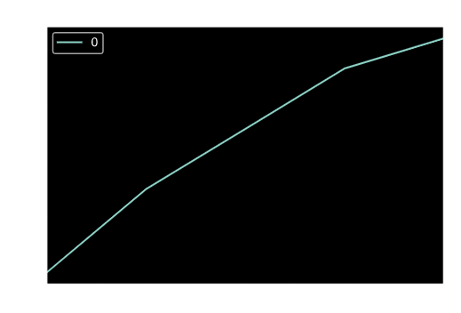

# time_series_homework

# Assessing Time Series Analysis
In this assesment we looked at the value of the yen. The price is plotted below. Based on the plot, it looks like there has been variability but possibly a upcoming rising of the Japanese Yen against the Dollar. There are some trends that last for a few years either up or down trends and lots of short term variation. Looks like most recently the Yen rose against the USD before falling and has been attempting to rise again, may potentially rise again soon vs the USD.

Several model types were evaluated for understanding the price of yen vs its trend, once the noise was removed.
### ARMA Model

The P-Value of the Returns of Settle Prices based on the Dickey Fuller test is very low < 0.05. This means the returns of the settle price data is possibly stationary. This means there is a chance that the data is not stationary. For an ARMA model to be a good model and properly applied the data-set needs to be stationary. If a data set is non-stationary or possibly stationary, it would have to be stationarized first. Granted, as the p-value <0.05 this data is more likely to be stationary than if p -value >0.05. So the ARMA is an ok model, but not 100% certain as we don't know what the chance of the data being non-stationary. In this case a better model type may be the ARIMA model shown below as it stationarizes the data as part of the model in the event that it is non-stationary. And since the given p-value just shows there's a chance its stationary, but not a for sure answer, automatically having the data stationarized before forecasting may yield more accurate and reliable model results.

### ARIMA Model

The model forecasts that in the near term (next 5 days) the price and value of the Yen will increase. Based on the p-value being < 0.5 the ARIMA model is a better fit as it stationarizes the data to help in better modeling and forecasting on a proper data set.

### GARCH Model

Based on the p-value, the GARCH is a good model as well since it works with possibly non-stationary data. However, the GARCH model does really flatten out an type of curvation to the data in its rising trend. For this reason, the ARIMA model may still be slightly better because it shows more of a natural rise than a straightline prediction which may leave no room for some variation and dipping in the up trend.

### Conclusions on Time Series Analaysis Models 
Based on the above time series analysis I would buy the yen now as it is in line with its trending behavior. Based on the model evaluation with multiple modeling types, I would feel confident to buy the yen and use these models for trading as it shows that the forecast near term is predicting an increase in the value of the yen. The risk of the yen will likely increase after this forecasted uptrend as in the initial price plot there was some uptrend building until our model forecasts. This given the cyclical appearing nature of previous rises and falls of the value of the yen would lead to the conclusion that if the yen rises short term it will likely have some type of pullback post rise and even potentially a downturn before again rebalancing and rising.

----

# Assessing Regression Analysis
In this piece of the analysis, a linear regression model was produced using a train test split. It's performance was evaluated for the out-of-sample and in-sample data to view the root mean squared error. The predicted return and returns can be viewed in the following plot. The model does better on out-of-sample data vs in-sample data since the RMSE (root mean squared error) value is lower for the out-of-sample data(RMSE=0.41)than the in-sample data(RMSE=0.57). The lower the RMSE, the better fit the model is and the better it is at predicting accurately coming behavior. This is interesting because you would expect it to fit best on the data it was made with and trained with. However,given the fact that the model is even better at out-of-sample data, that would entail it was not overfit and not under fit since it performs very well, as it is still similar to the in-sample data performance.

